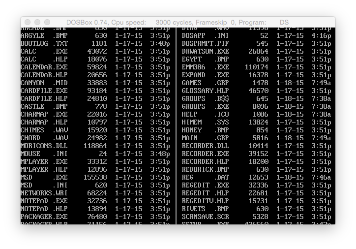

This project and related files are subject to the terms of the **_Mozilla Public License_**, 
v. 2.0. If a copy of the MPL was not distributed with this file, You can obtain one at 
http://mozilla.org/MPL/2.0/.

Copyright 1990-2015 Jerome Shidel.
### Directory Scroller

**_DS.PAS_** Was an experimental _smooth scrolling_ text-mode directory listing program. 
It was inspired by a terrible data entry program. When I saw that system, I though to myself
"This program is garbage. But, that is really COOL! I've gotta have it!" So, it was built on
an earlier version of D.PAS (I think version 5.00). It was utilizing a cool trick I had learned 
to smoothly scroll text onto the screen. Like watching movie credits.  Only not in graphics, 
but in text mode. It will **NOT** word in a Windows Command Line window. It will **NOT** work 
inside a virtual machine like VMware Fusion. It requires a real DOS _bare-metal_ environment to 
work correctly. Or, as I just found out, it mostly works fine in **_DOSBOX_**. It will run on others,
but poorly and without smooth scrolling. I had to swap out _Borland's CRT_ unit references for my _QCrt_ unit to get it to run on faster hardware. Then had to get a 19-year old Pentium Pro running to test the change. It worked fine. However, I have no idea if it will work on modern computer chipsets. 
