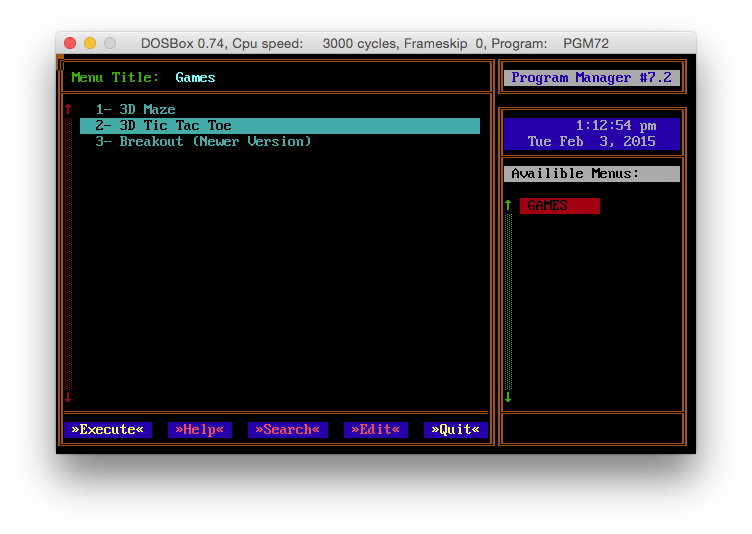

This project and related files are subject to the terms of the Mozilla Public License, 
v. 2.0. If a copy of the MPL was not distributed with this file, You can obtain one at 
http://mozilla.org/MPL/2.0/.

Copyright 1990-2015, Jerome Shidel.

### Program Manager v7.2 (PGM72.PAS)

**_PGM72.PAS_** Multiple menu, text mode program launcher with mouse support for DOS. 

**_INSTALL.PAS_** Very simple installer for PGM 7.2. Basically, creates a directory and
copies PGM72.EXE there. The creates the launcher batch file. 

